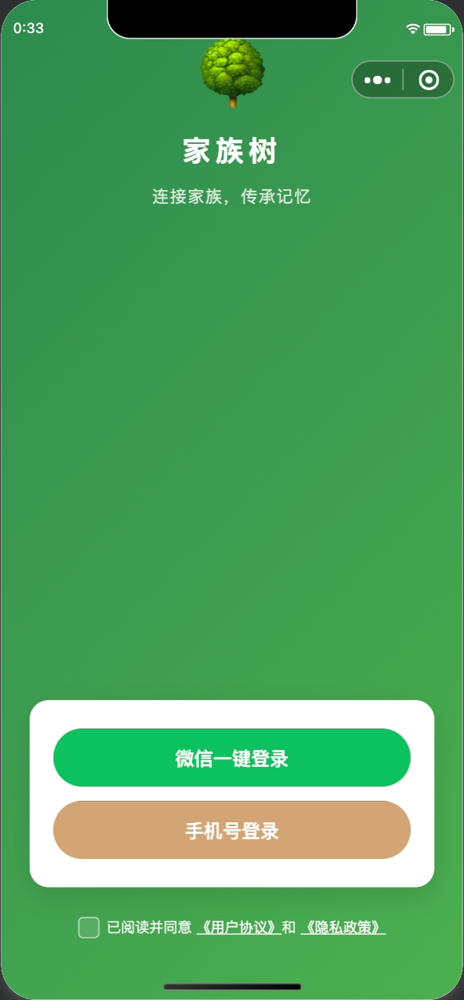
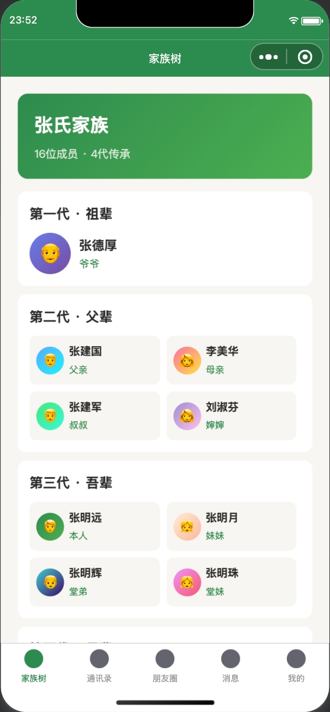
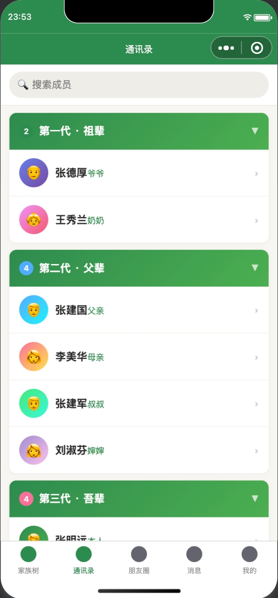
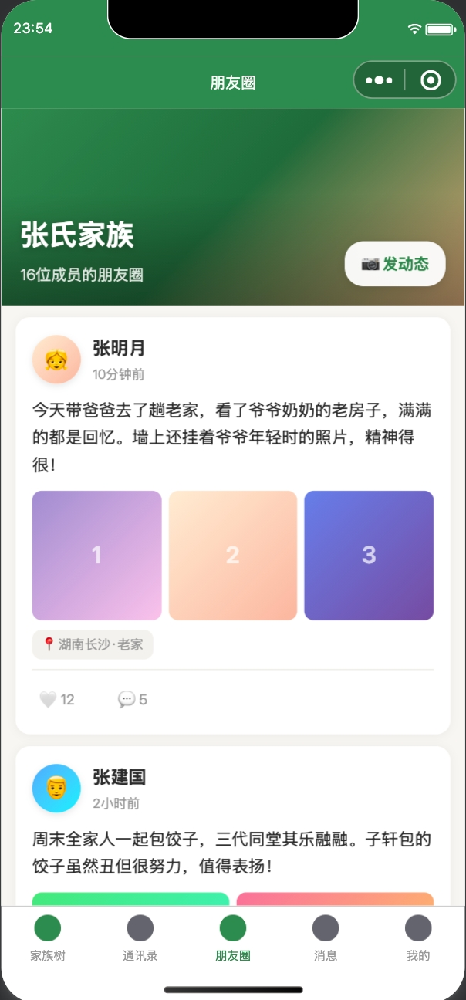
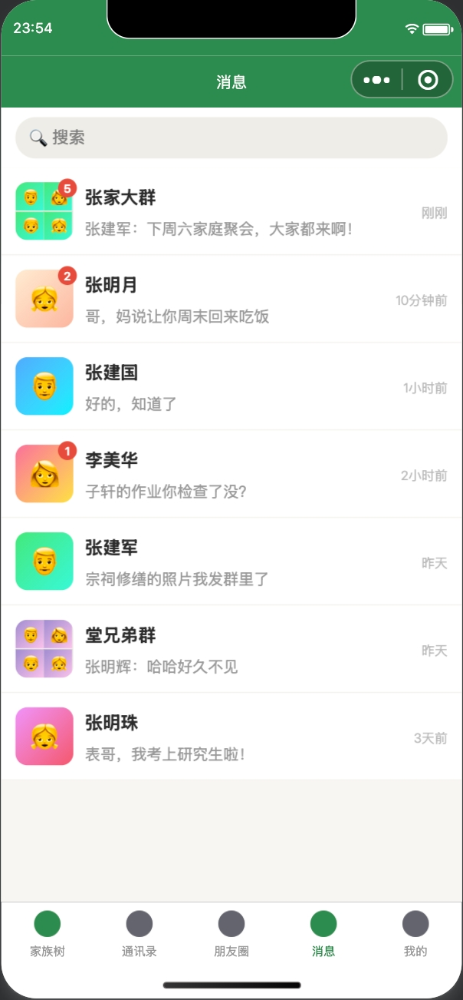
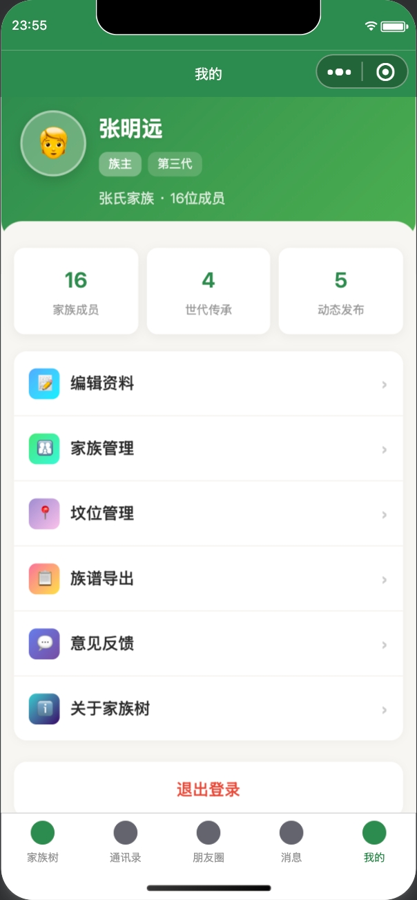
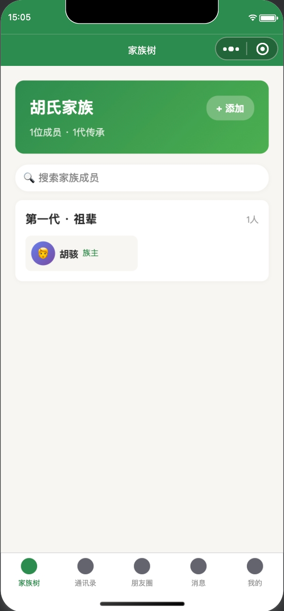
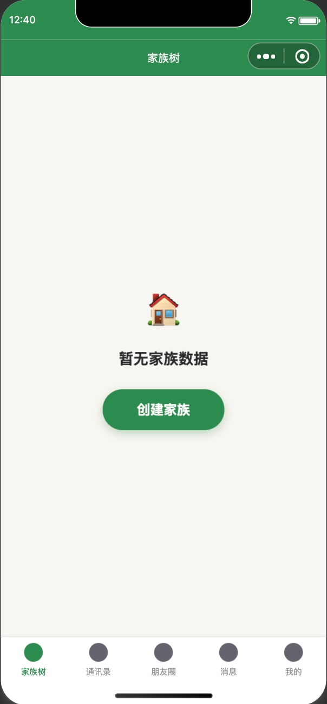
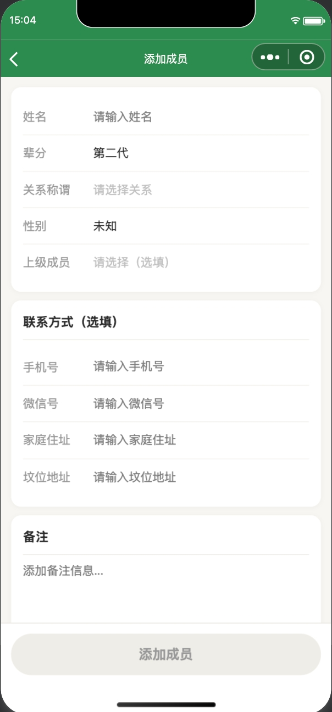

# Family Tree - 家族树社交小程序

一款以家族为核心的社交小程序，支持上下四代家族成员管理、联系方式/家庭住址/坟位地址记录、家族朋友圈、私聊与群聊。采用温暖的树绿色系设计语言，让家族传承触手可及。

## 设计预览

<table>
  <tr>
    <td align="center"><b>登录</b></td>
    <td align="center"><b>家族树</b></td>
    <td align="center"><b>通讯录</b></td>
  </tr>
  <tr>
    <td></td>
    <td></td>
    <td></td>
  </tr>
  <tr>
    <td align="center"><b>朋友圈</b></td>
    <td align="center"><b>消息</b></td>
    <td align="center"><b>我的</b></td>
  </tr>
  <tr>
    <td></td>
    <td></td>
    <td></td>
  </tr>
</table>

<details>
<summary>查看更多截图</summary>

| 新建家族树 | 空状态 | 添加成员 |
|:---:|:---:|:---:|
|  |  |  |

</details>

## 核心功能

### 家族树
- 上下四代家族成员树形展示
- 按辈分分组，一目了然
- 支持搜索成员、查看详情
- 一键添加新成员

### 通讯录
- 字母索引快速定位
- 展示手机号、微信、家庭住址、坟位地址
- 一键拨号 / 复制号码
- 坟位地图导航（腾讯地图）

### 朋友圈
- 家族内部动态发布（文字 + 图片，最多 9 张）
- 点赞、评论互动
- 位置标签
- 图片大图预览

### 消息
- 私聊 + 家族群聊
- 文本、图片、位置消息
- 会话列表管理

### 我的
- 个人信息管理
- 家族设置
- 家族统计数据

## 技术架构

| 层 | 技术 | 说明 |
|---|---|---|
| 前端 | uni-app (Vue 3 + TypeScript) | 一套代码编译到微信小程序 / Android / iOS / H5 |
| 后端 | uniCloud 阿里云 (Serverless) | 云对象 + 云函数，免运维 |
| 数据库 | uniCloud DB (文档型) | Schema 约束，前端通过云函数访问 |
| 即时通讯 | 融云 IM SDK | 私聊 + 群聊，免费 100 并发 |
| 地图 | 腾讯地图 | 坟位/住址定位，小程序内置 |

## 项目结构

```
family-tree/
├── api/                          # 前端 API 层（统一调用云对象）
│   ├── family.ts                 # 家族成员 CRUD
│   ├── moments.ts                # 朋友圈接口
│   ├── chat.ts                   # 聊天接口
│   └── user.ts                   # 用户接口
├── components/                   # 公共组件
│   ├── FamilyTreeCanvas/         # 家族树画布
│   ├── MemberCard/               # 成员卡片
│   ├── ChatBubble/               # 聊天气泡
│   └── MomentsCard/              # 朋友圈卡片
├── pages/                        # 页面
│   ├── family-tree/              # 家族树
│   ├── contacts/                 # 通讯录
│   ├── moments/                  # 朋友圈 + 发布
│   ├── chat/                     # 消息列表
│   ├── chat-detail/              # 聊天详情
│   ├── member/                   # 成员详情 + 添加
│   ├── mine/                     # 我的
│   └── login/                    # 登录
├── stores/                       # Pinia 状态管理
│   ├── familyStore.ts
│   ├── chatStore.ts
│   └── userStore.ts
├── uniCloud-aliyun/              # 云端代码
│   ├── cloudfunctions/           # 云函数（生产部署）
│   │   ├── co-family/            # 家族模块
│   │   ├── co-moments/           # 朋友圈模块
│   │   ├── co-chat/              # 聊天模块
│   │   └── co-user/              # 用户模块
│   ├── cloudobjects/             # 云对象（本地调试）
│   ├── database/                 # 数据库 Schema
│   └── common/                   # 公共模块
├── doc/                          # 设计稿 & 文档
└── static/                       # 静态资源（tabbar 图标等）
```

## 数据库设计

| 表名 | 说明 | 关键字段 |
|---|---|---|
| `uni-id-users` | 用户表（uni-id 内置） | nickname, avatar, phone |
| `family` | 家族表 | name, memberCount, ownerId |
| `familyMember` | 家族成员 | familyId, name, generation, parentId, role |
| `memberContact` | 联系方式 | memberId, phone, wechat, homeAddress, graveAddress |
| `moments` | 朋友圈动态 | familyId, authorId, content, images, location |
| `momentsLike` | 点赞记录 | momentId, userId |
| `momentsComment` | 评论 | momentId, authorId, content |
| `chatConversation` | 会话 | type(私聊/群聊), members |
| `chatMessage` | 消息 | conversationId, senderId, content, type |

## 权限体系

```
族主 (OWNER)     → 所有操作 + 角色管理 + 删除家族
管理员 (ADMIN)   → 添加/编辑成员 + 发布动态
普通成员 (MEMBER) → 查看族谱 + 通讯录 + 朋友圈互动
```

## 快速开始

### 环境要求

- [HBuilderX](https://www.dcloud.io/hbuilderx.html) 3.8+
- 微信开发者工具（调试小程序）
- Node.js 16+

### 安装步骤

1. **克隆项目**
   ```bash
   git clone https://github.com/XiaoHuZi-design/family-tree.git
   cd family-tree
   ```

2. **用 HBuilderX 打开项目**

3. **关联云服务空间**
   - 项目根目录右键 → `创建 uniCloud 云开发环境` → 选择阿里云
   - 上传数据库 Schema（`uniCloud-aliyun/database/` 下的 `.schema.json` 文件）
   - 上传云函数（`uniCloud-aliyun/cloudfunctions/` 下的目录）

4. **运行到微信小程序**
   - HBuilderX 顶部菜单 → `运行` → `运行到小程序模拟器` → `微信开发者工具`

5. **配置微信小程序**
   - 在 [微信公众平台](https://mp.weixin.qq.com/) 注册小程序
   - 获取 AppID，填入 `manifest.json`
   - 开通微信一键登录能力

## 费用说明

| 项目 | 费用 |
|---|---|
| HBuilderX | 免费 |
| uniCloud 阿里云版 | 免费额度内（1000 GBs/月） |
| 微信小程序（个人） | 免费 |
| 腾讯地图 API | 免费（日配额 1 万次） |
| 融云 IM 免费版 | 免费（100 并发） |
| **前期总成本** | **0 元** |

## 开发进度

- [x] 登录（微信一键登录）
- [x] 家族树（按辈分分组展示）
- [x] 通讯录（字母索引 + 联系方式）
- [x] 添加/编辑成员（含联系方式）
- [x] 朋友圈（发布 + 点赞 + 评论）
- [x] 消息列表
- [ ] 私聊 + 群聊（融云 IM 接入）
- [ ] 我的页面完善
- [ ] iOS / Android 打包

## License

MIT
